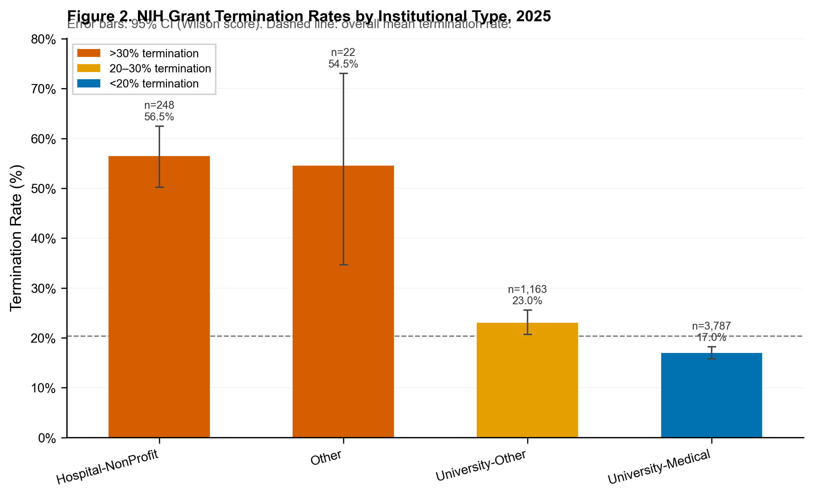
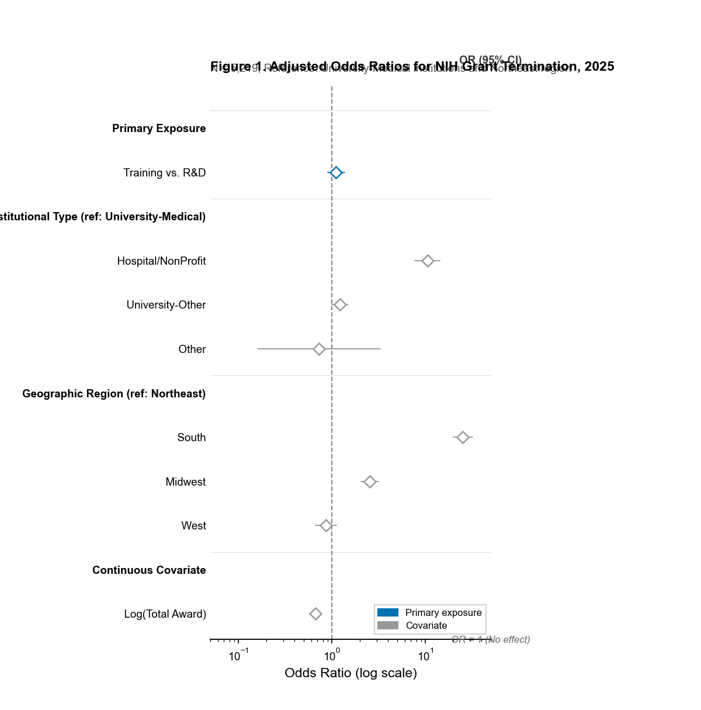

<!-- Slide 1: Title -->
# Institutional Type and Geographic Region, Not Funding Category, Drive NIH Grant Termination in 2025

**A Cross-Sectional Analysis of 5,219 NIH Grants**

Junyang Deng, Shupeng Luxu, Nuo Ding, Claude

JAMA Network Open | 2026

---

<!-- Slide 2: Key Question -->
## Research Question

**Were NIH research training grants disproportionately terminated in 2025 compared with research and development grants?**

### Why This Matters

- 2025 federal funding actions affected **$17.2 billion** in NIH research awards
- Early reports suggested training grants (F/K/T series) were **particularly vulnerable**
- Impact on **early-career researchers** and scientific workforce diversity

---

<!-- Slide 3: Study Overview -->
## Study Design at a Glance

<div class="two-column">

**Design & Setting**

- Cross-sectional analysis
- NIH Grant Witness termination dataset
- Public registry of affected awards

**Sample**

- 5,219 NIH grants with definitive outcomes
- Excluded: frozen, minor categories, missing data

**Time Period**

- Data exported: March 2026
- Captures February-March 2025 actions

**Comparison Groups**

| Training Grants | R&D Grants |
|----------------|------------|
| F31/F32/F30 fellowships | R01/R21/R03 |
| T32 training grants | R56 mechanism |
| K01/K08/K23/K99 awards | |

</div>

---

<!-- Slide 4: Unadjusted Findings -->
## Unadjusted Termination Rates Revealed Apparent Disparity

<div class="two-column">

<div>

**Training Grants: 30.1%**

- 469 of 1,558 terminated
- Nearly double the rate of R&D grants

**R&D Grants: 16.2%**

- 594 of 3,661 terminated
- Baseline comparison

**Crude Difference: 14 percentage points**

- Suggested training grants were disadvantaged
- BUT: Did not account for confounding factors

</div>

<div>

<div class="chart-placeholder">



**Figure 1. Termination Rates by Grant Type**

</div>

</div>

</div>

---

<!-- Slide 5: Adjusted Analysis -->
## After Adjustment, Training Grants Were NOT Significantly Associated with Termination

<div class="two-column">

<div>

**Multivariable Logistic Regression**

Adjusted for:
- Institutional type (4 categories)
- Geographic region (4 Census regions)
- Total award amount (log-transformed)

**Primary Result**

<span class="key-stat">OR = 1.11</span>

<span class="stat-label">95% CI: 0.90–1.36 | P = .33</span>

**Interpretation**

Training grant status was **not** an independent predictor of termination after accounting for institutional and geographic factors.

</div>

<div>

<div class="chart-placeholder">



**Figure 2. Adjusted Odds Ratios for Grant Termination**

</div>

</div>

</div>

---

<!-- Slide 6: Geographic Region -->
## Geographic Region Was the Dominant Predictor

<div class="two-column">

<div>

**South: 25x Higher Termination Odds**

- OR = 25.23 (95% CI: 19.96–31.89)
- Compared to Northeast (reference)
- <span class="highlight">P < .001</span>

**Midwest: 2.5x Higher**

- OR = 2.54 (95% CI: 2.05–3.14)
- <span class="highlight">P < .001</span>

**West: No Significant Difference**

- OR = 0.86 (95% CI: 0.67–1.11)
- P = .25

**Key Insight**

Training grants are disproportionately located in Southern states—explaining much of the crude association.

</div>

<div>

<div class="chart-placeholder">


**Geographic Variation in Termination Risk**

</div>

</div>

</div>

---

<!-- Slide 7: Institutional Type -->
## Hospital and Non-Profit Institutions Faced 10-Fold Higher Termination Odds

<div class="two-column">

<div>

**Hospital/Non-Profit: 10.5x Higher**

- OR = 10.52 (95% CI: 7.69–14.38)
- Compared to University-Medical schools
- <span class="highlight">P < .001</span>

**University-Other: Borderline Elevated**

- OR = 1.22 (95% CI: 1.00–1.49)
- P = .051

**University-Medical: Reference**

- Lowest termination rate at 17.0%

**Why?**

- Fewer legal/administrative resources
- Less leverage to contest terminations
- Smaller grant portfolios = more vulnerable

</div>

<div>

<div class="chart-placeholder">


**Figure 3. Termination Rates by Institutional Type**

Hospital/Non-Profit: 56.5%
Other: 54.5%
University-Other: 23.0%
University-Medical: 17.0%

</div>

</div>

</div>

---

<!-- Slide 8: Award Size -->
## Higher Award Amounts Were Protective Against Termination

<div class="two-column">

<div>

**Each Log-Unit Increase in Award**

<span class="key-stat">OR = 0.66</span>

<span class="stat-label">95% CI: 0.62–0.71 | P < .001</span>

**Interpretation**

- 34% reduction in termination odds per unit
- Higher-value grants received preferential protection
- Larger grants support more complex programs
- More visible institutional advocacy

**Typical Award Sizes**

- R&D grants: Median $2.1M
- Training grants: Median $274K

</div>

<div>

<div class="chart-placeholder">

```
Termination Probability by Award Size

$50K    ████████████████████  45%
$250K   ████████████████      30%
$1M     ██████████            18%
$3M     ███████               12%
```

**Figure 4. Termination Probability Decreases with Award Size**

</div>

</div>

</div>

---

<!-- Slide 9: Sensitivity Analyses -->
## Sensitivity Analyses Confirmed Robustness of Findings

| Analysis | OR (95% CI) | P Value | Interpretation |
|----------|-------------|---------|----------------|
| **Primary** | 1.11 (0.90–1.36) | .325 | Training grants not significant |
| **Stratified: University-Medical** | 1.22 (0.94–1.59) | .136 | Consistent within major institutions |
| **Stratified: University-Other** | 1.17 (0.77–1.76) | .460 | Consistent within other universities |
| **Without geographic adjustment** | 1.24 (1.03–1.48) | .020 | <span class="highlight">Confirms geographic confounding</span> |
| **State fixed effects** | 1.09 (0.87–1.36) | .450 | Robust to geographic adjustment method |

**Key Takeaway**

When geographic region is excluded, training grants appear significant—confirming that geography explains the crude association.

---

<!-- Slide 10: Summary of Findings -->
## Three Key Findings

<div class="two-column">

<div>

**1. Training Grants Were Not Targeted**

- After adjustment, training grant status was NOT significantly associated with termination
- OR = 1.11, P = .33
- The apparent disparity was explained by confounding factors

**2. Geography Was the Primary Driver**

- Southern institutions faced 25x higher termination odds
- Midwest faced 2.5x higher odds
- Regional patterns suggest structural, not grant-level, targeting

</div>

<div>

**3. Institutional Type Mattered Greatly**

- Hospital/Non-Profit: 10.5x higher odds
- These institutions have fewer resources to contest terminations
- Award size was protective (larger grants survived more often)

</div>

</div>

---

<!-- Slide 11: Policy Implications -->
## Policy Implications and Next Steps

**Equity-Focused Responses Should Target:**

- **Underresourced institutional contexts** — hospitals, non-profits, community-based organizations
- **Geographic regions** with higher termination rates — particularly Southern states
- **Smaller award programs** — regardless of grant mechanism

**NOT Just Grant Mechanisms**

- Training grants themselves were not the problem
- Protecting scientific workforce requires addressing structural inequities
- Geographic diversity of US biomedical research is at risk

**Future Directions**

- Longitudinal tracking of reinstatement outcomes
- Qualitative studies of institutional advocacy capacity
- Linkage with full NIH portfolio to calculate true incidence

---

<!-- Slide 12: Conclusions -->
## Conclusions

**In this cross-sectional analysis of 5,219 NIH grants:**

- Geographic region and institutional type—**not** grant funding category—were the primary structural predictors of permanent termination
- Southern-state institutions and hospital/non-profit settings faced dramatically higher termination odds
- Policy responses should prioritize underresourced institutional and regional contexts, **irrespective of grant mechanism**

**Bottom Line**

The 2025 NIH grant terminations were not about training vs. research—they were about **where** the research was happening and **who** was doing it.

---

<!-- Slide 13: Q&A -->
## Thank You

**Questions & Discussion**

---

## Backup: Key References

- Grant Witness Dataset. https://grantwitness.com
- NIH RePORTER. https://reporter.nih.gov
- Mastej et al. (2025). Impact on scientific training programs
- Miller et al. (2026). JAMA Pediatrics — selective termination patterns

**Data & Code Availability**

The NIH Grant Witness termination dataset is publicly available. Analysis code available upon request.

---

## Backup: Acknowledgments

**Conflicts of Interest:** None reported

**Funding:** None

**Author Contributions:**
- Deng: study design, data analysis, manuscript drafting
- Luxu: literature review, results interpretation
- Ding: statistical analysis, figure generation
- Claude: analysis automation, manuscript writing
